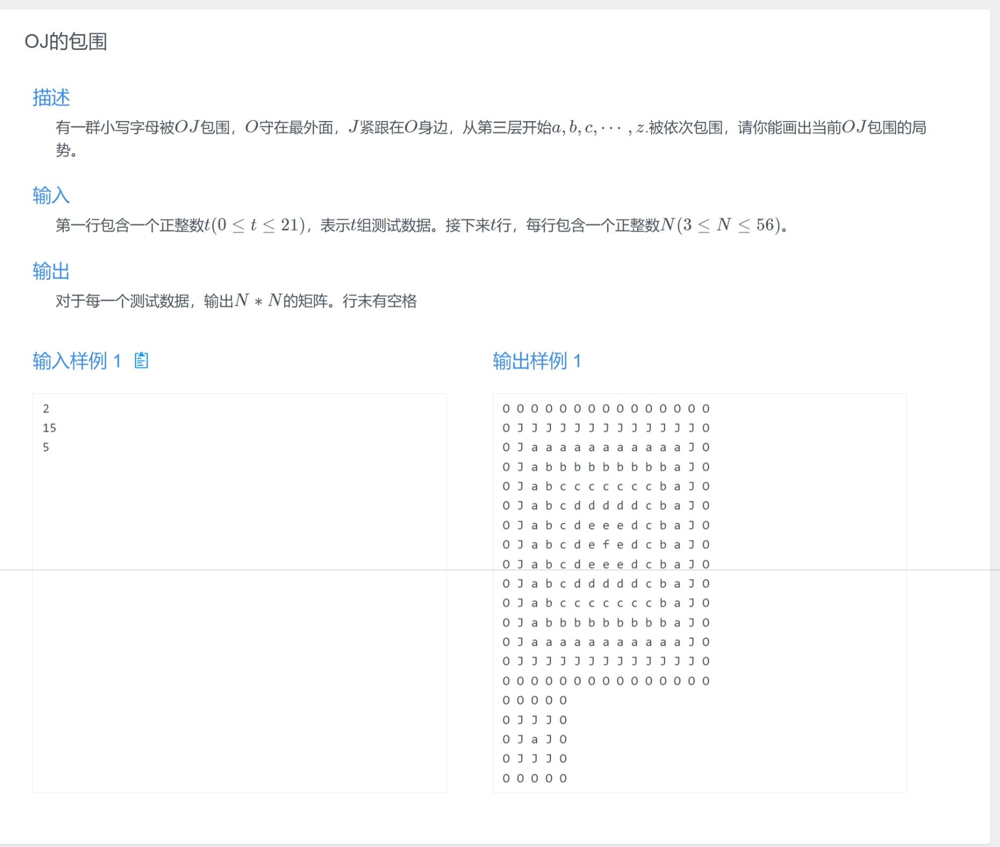
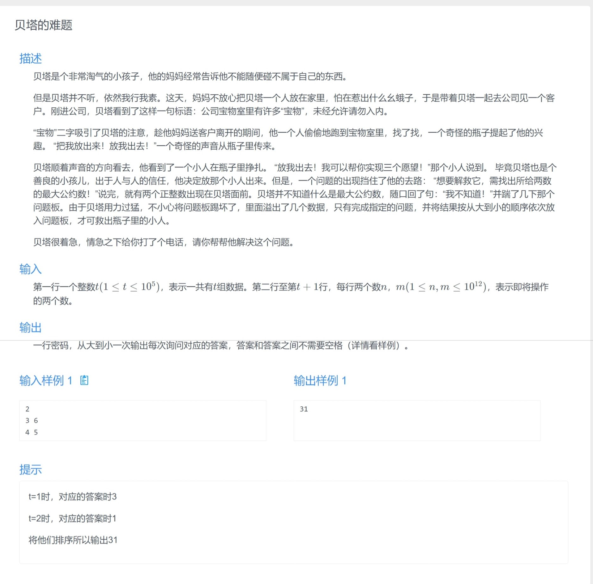
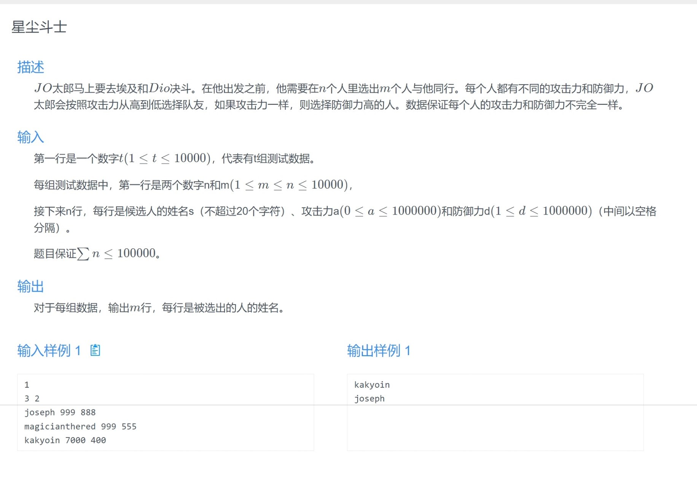
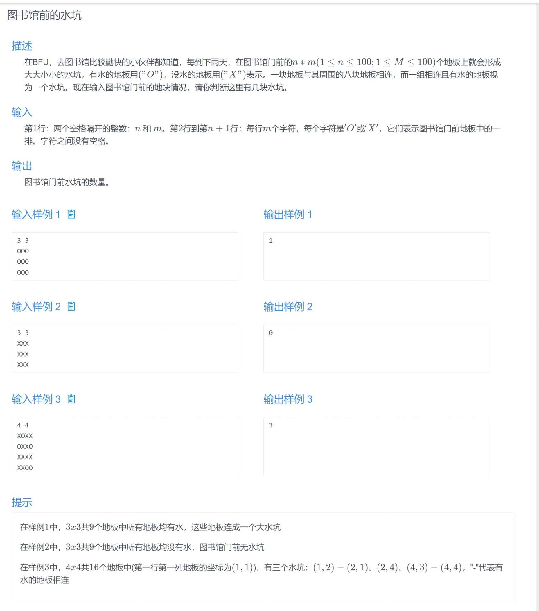
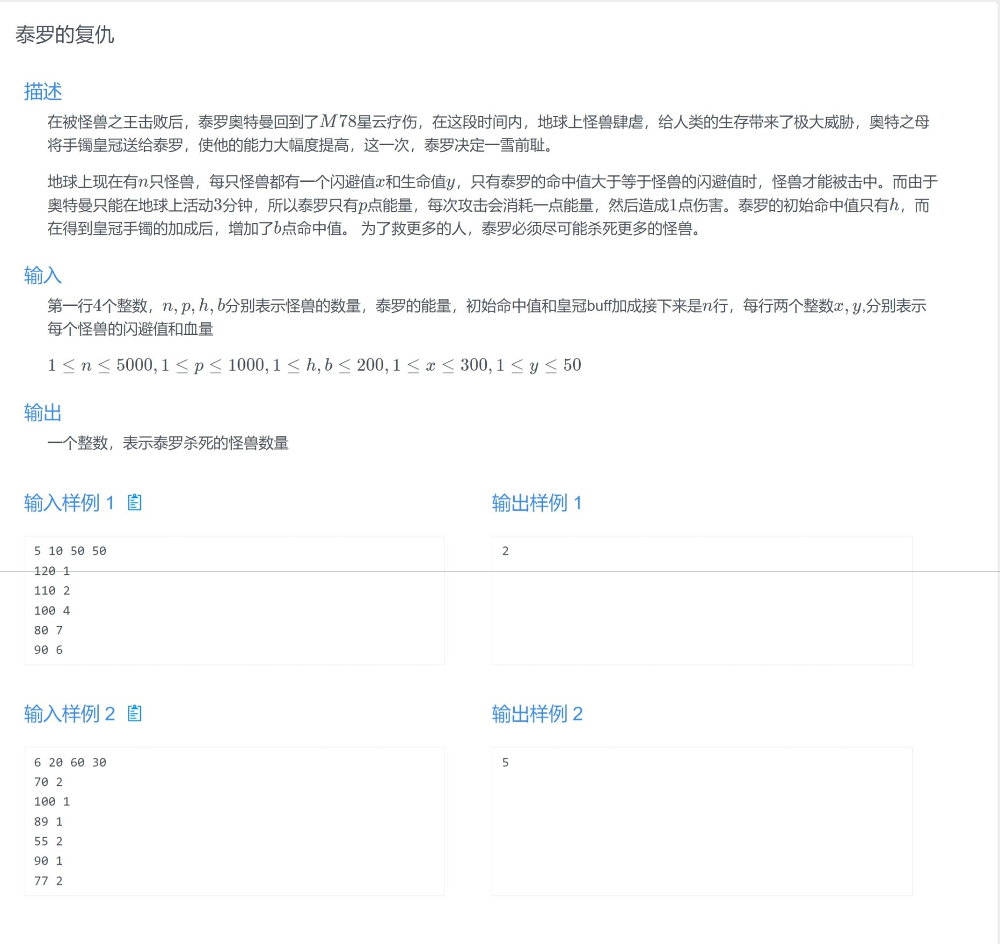
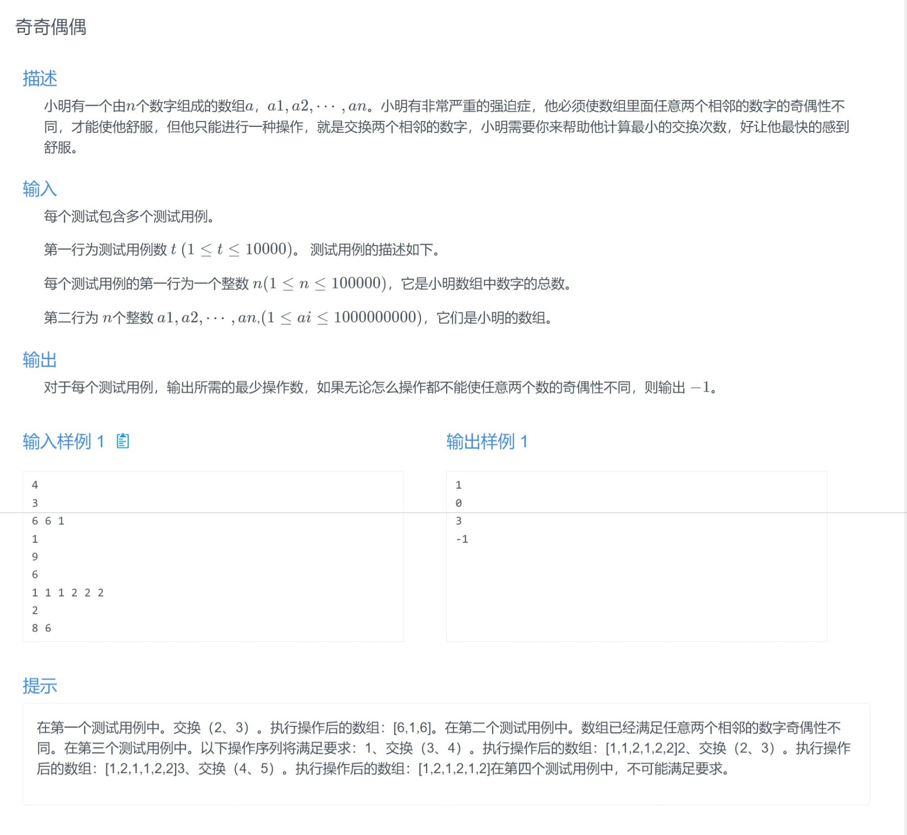
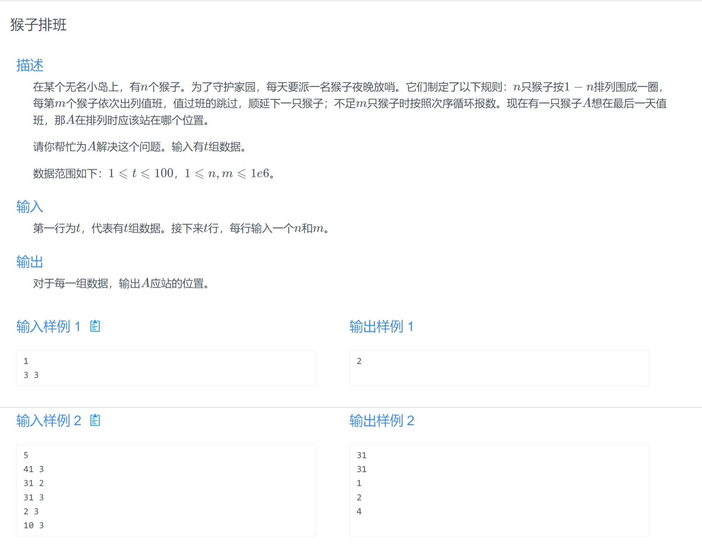
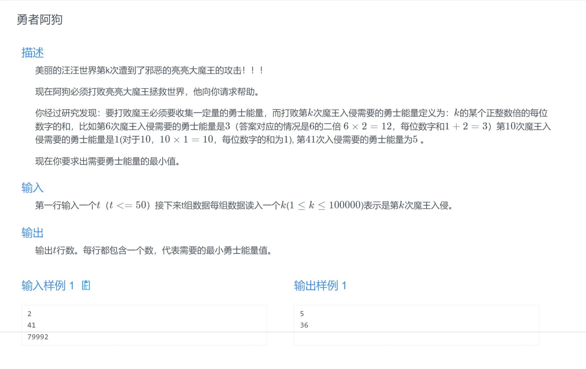

## A Hello World 复现

### 题面


### 思路

签到题。

### 代码

```cpp
#include <bits/stdc++.h>
using namespace std;

int main(){
	int n;
	cin >> n;
	cout << "Hello World " << n;
}
```


## B OJ的包围

### 题面



### 思路

模拟题，由外向内逐层填字符即可。

可以提前处理出来每一层的字符来化简代码量。

### 代码

```cpp
#include <bits/stdc++.h>
#define FAST_IO ios::sync_with_stdio(0), cin.tie(0), cout.tie(0);
using namespace std;

void solve();

int main(){
	FAST_IO
	int t = 1;
	cin >> t;
	while(t--){
		solve();
	}
}

const int N = 60;
const char s[] = " OJabcdefghijklmnopqrstuvwxyz";

int n;
char g[N][N];

void solve(){
	cin >> n;
    
	for(int i = 1, j = n; i <= j; i++, j--){
		for(int k = i; k <= j; k++){
			g[i][k] = g[k][i] = g[j][k] = g[k][j] = s[i];
		}
	}

	for(int i = 1; i <= n; i++){
		for(int j = 1; j <= n; j++){
			cout << g[i][j] << ' ';
		}
		cout << '\n';
	}
}
```


## C JJR的神奇克隆机器

### 题面


### 思路

由于原本数量初始为 $1$ ，因此

+ 当 $y=0$ 时，答案一定为 `NO` 。

+ 当 $y=1$ 时，无法进行复制复制品操作，此时只有 $x=0$ 合法 。
+ 当 $y>1$ 时，由于获得原本操作只能通过操作 $1$ 实现，因此我们优先进行操作 $1$ 来得到 $y$ 本原本。若复制品不够，则使用操作 $2$ 来增加复制品个数。那么，此时会出现几个问题
  + 当获得 $y$ 本原本后，复制品个数大于 $x$ ，则无法实现。
  + 当获得 $y$ 本原本后，复制品个数小于等于 $x$ ，若此时复制品个数与 $x$ 差值为奇数，则无法通过操作 $2$ 得到恰好 $x$ 本。


注意本题需要使用 `long long` 。

### 代码

```cpp
#include<bits/stdc++.h>
#define FAST_IO ios::sync_with_stdio(0), cin.tie(0), cout.tie(0);
using namespace std;
using ll = long long;

void solve();

int main(){
	FAST_IO
	int t = 1;
	cin >> t;
	while(t--){
		solve();
	}
}

ll x, y;

void solve(){
	
	cin >> x >> y;
	if(y == 0){
		cout << "No" << '\n';
	}
	else if(y == 1)
	{
		if(x == 0){
			cout << "Yes" << '\n';
		}
		else{
			cout << "No" << '\n';
		}
	}
	else{
		int delta = x - (y - 1);
		if(delta < 0){
			cout << "No" << '\n';
		}
		else{
			if(delta & 1){
				cout << "No" << '\n';
			}
			else{
				cout << "Yes" << '\n';
			}
		}
	}
}
```


## D 贝塔的难题

### 题面



### 思路

首先求出每两个数的 $gcd$ ，然后排序即可。

求解 $gcd$ 可以使用 `__gcd(int a, int b)` 函数，也可以自己手写一个 $gcd$ 函数：

```cpp
int gcd(int a, int b){
	return b ? gcd(b, a % b) : a;
}
```


从大到小排序可以使用 `greater<int>()` ，也可以手写一个比较器：

```cpp
bool cmp(int lhs, int rhs){
    return lhs > rhs;
}
```


注意本题需要使用 $long\ long$ 。

### 代码

```cpp
#include<bits/stdc++.h>
#define FAST_IO ios::sync_with_stdio(0), cin.tie(0), cout.tie(0);
using namespace std;
using ll = long long;

void solve();

int main(){
	FAST_IO
	int t = 1;
//	cin >> t;
	while(t--){
		solve();
	}
}

const int N = 1e5 + 10;

ll n, res[N];

void solve(){
	cin >> n;
	
	for(int i = 0; i < n; i++){
		ll a, b;
		cin >> a >> b;
		res[i] = __gcd(a, b);
	}
	
	sort(res, res + n, greater<ll>());
	
	for(int i = 0; i < n; i++){
		cout << res[i];
	}
	
}
```


## E 星尘斗士

### 题面



### 思路

模拟题，学会使用结构体排序即可。

### 代码

```cpp
#include<bits/stdc++.h>
#define FAST_IO ios::sync_with_stdio(0), cin.tie(0), cout.tie(0);
using namespace std;
using ll = long long;

void solve();

int main(){
	FAST_IO
	int t = 1;
	cin >> t;
	while(t--){
		solve();
	}
}

const int N = 1e5 + 10;

struct Person{
	string s;
	int a, d;
	
	bool operator < (const Person &rhs){
		if(a != rhs.a) return a > rhs.a;
		return d > rhs.d;
	}
};

int n, m;
Person people[N];

void solve(){
	cin >> n >> m;
	for(int i = 0; i < n; i++){
		string s;
		int a, d;
		cin >> s >> a >> d;
		people[i] = {s, a, d};
	}
	
	sort(people, people + n);
	
	for(int i = 0; i < m; i++){
		cout << people[i].s << '\n';
	}
}
```


## F 图书馆前的水坑

### 题面



### 思路

经典的 $Flood\ Fill$ 算法，使用 $bfs$ 或 $dfs$ 填满遇到的水坑。

### 代码

```cpp
#include<bits/stdc++.h>
#define FAST_IO ios::sync_with_stdio(0), cin.tie(0), cout.tie(0);
using namespace std;
using ll = long long;

void solve();

int main(){
	FAST_IO
	int t = 1;
//	cin >> t;
	while(t--){
		solve();
	}
}

const int N = 105;

int n, m;
char g[N][N];

void dfs(int x, int y){
	if(g[x][y] == 'X') return;
	g[x][y] = 'X';
	for(int dx = -1; dx <= 1; dx++){
		for(int dy = -1; dy <= 1; dy++){
			dfs(x + dx, y + dy);
		}
	}
}

void solve(){
	memset(g, 'X', sizeof g);
	
	cin >> n >> m;
	for(int i = 1; i <= n; i++){
		for(int j = 1; j <= m; j++){
			cin >> g[i][j];
		}
	}
	
	int res = 0;
	
	for(int i = 1; i <= n; i++){
		for(int j = 1; j <= m; j++){
			if(g[i][j] == 'O'){
				dfs(i, j);
				res++;
			}
		}
	}
	
	cout << res << '\n';
}
```


## G 泰罗的复仇

### 题面



### 思路

考虑贪心，对于所有可以攻击的怪兽，优先攻击生命值低的怪兽，从而可以让我们击败最多数量的怪兽。

### 代码

```cpp
#include<bits/stdc++.h>
#define FAST_IO ios::sync_with_stdio(0), cin.tie(0), cout.tie(0);
using namespace std;
using ll = long long;

void solve();

int main(){
	FAST_IO
	int t = 1;
//	cin >> t;
	while(t--){
		solve();
	}
}

const int N = 5005;

int n, p, h, b;
int hp[N], idx = 0;

void solve(){
	cin >> n >> p >> h >> b;
	for(int i = 0; i < n; i++){
		int x, y;
		cin >> x >> y;
		if(h + b >= x){
			hp[idx++] = y;
		}
	}
	
	sort(hp, hp + idx);
	
	int res = 0;
	for(int i = 0; i < idx; i++){
		if(p >= hp[i]){
			p -= hp[i];
			res++;
		}
	}
	
	cout << res << '\n';
}
```


## H 小明的烦恼

### 题面


### 思路

根据欧拉回路定理，该图存在欧拉回路，因此答案为所有路径的和。

四舍五入使用如下方式：

```cpp
double res;
cout << (int)(res + 0.5) << '\n';
//本题中使用round(res)会导致wrong answer，暂时不知道原因。
```

### 代码

```cpp
#include<bits/stdc++.h>
#define FAST_IO ios::sync_with_stdio(0), cin.tie(0), cout.tie(0);
using namespace std;
using ll = long long;
using db = double;

void solve();

int main(){
	FAST_IO
	int t = 1;
//	cin >> t;
	while(t--){
		solve();
	}
}

db dist(db x1, db y1, db x2, db y2){
	return sqrt((x1 - x2) * (x1 - x2) + (y1 - y2) * (y1 - y2));
}

void solve(){
	db x1, y1, x2, y2, res = 0;
	cin >> x1 >> y1;
	
	while(cin >> x1 >> y1 >> x2 >> y2){
		res += dist(x1, y1, x2, y2);
	}
	
	cout << (int)(2 * res + 0.5) << '\n';
}
```


## I 奇奇偶偶

### 题面



### 思路

首先考虑数列中奇数和偶数的个数 $oddnum$ ， $evennum$ ，若 $abs(oddnum - evennum)>1$ ，则一定无法实现操作。

否则，

若 $oddnum>evennum$ ，则序列一定为 `odd even odd even odd` 这样的形式。若 $oddnum>evennum$ ，则为 `even odd even odd even` 这样的形式。若 $oddnum=evennum$ ，则既可以是 `odd even odd even` ，也可以是 `even odd even odd` 这样的形式。

最后，考虑如何以最小的步骤将数字移动到指定位置。对于数字 $a_i$ ，若其为奇数，则它需要移动的距离为 $i - (2 \times cnto - 1)$ ，其中 $cnto$ 为 $a[1,i]$ 中奇数的个数，$a[1,i]$ 表示序列 $a_1,a_2\cdots a_i$ ，偶数同理。

### 代码

```cpp
#include<bits/stdc++.h>
#define FAST_IO ios::sync_with_stdio(0), cin.tie(0), cout.tie(0);
using namespace std;
using ll = long long;
using db = double;

void solve();

int main(){
	FAST_IO
	int t = 1;
	cin >> t;
	while(t--){
		solve();
	}
}

const int N = 1e5 + 10;

ll n, a[N];
int res = 0;

void solve(){
	cin >> n;
	for(int i = 1; i <= n; i++){
		cin >> a[i];
	}
	
	int anso = 0, cnto = 0;
	int anse = 0, cnte = 0;
	for(int i = 1; i <= n; i++){
		if(a[i] & 1){
			cnto++;
			anso += abs(i - 2 * cnto + 1);
		}
		else{
			cnte++;
			anse += abs(i - 2 * cnte + 1);
		}
	}
	
	if(abs(cnto - cnte) > 1){
		cout << -1 << '\n';
		return;
	}
	else{
		if(cnto > cnte){
			cout << anso << '\n';
		}
		else if(cnte > cnto){
			cout << anse << '\n';
		}
		else{
			cout << min(anso, anse) << '\n';
		}
	}
}
```


## J 猴子排班

### 题面



### 思路

经典的约瑟夫环问题。

考虑倒推出：最后剩下的数字，在最开始的数组中的位置。

假设最后一轮的轮次为第 $n$ 轮。

1. 第 $n$ 轮时，剩下最后一个数字，总个数为 $1$ ，它的下标为 $pos_n = 0$ 。
2. 它在第 $n-1$ 轮中的下标为 $pos_{n-1} = (pos_n + m) \mod 2$ ，可以自行画图看出。
3. 同理，它在第 $n-2$ 中的下标为 $pos_{n-2} = (pos_{n-1}+m)\mod 3$ 。
4. 因此，我们发现，假如它在第 $n-i$ 轮中的下标为 $pos_{n-i}$ ，则第 $n-i-1$ 轮中的下标就为 $pos_{n-i-1}=(pos_{n-i}+m)\mod (i+2)$ 。

### 代码

```cpp
#include<bits/stdc++.h>
#define FAST_IO ios::sync_with_stdio(0), cin.tie(0), cout.tie(0);
using namespace std;
using ll = long long;
using db = double;

void solve();

int main(){
	FAST_IO
	int t = 1;
	cin >> t;
	while(t--){
		solve();
	}
}

int n, m;

void solve(){
	cin >> n >> m;
	
	int pos = 0;
	for(int i = 0; i <= n - 2; i++){
		//从第n轮开始，到第1轮结束
		pos = (pos + m) % (i + 2);
	}
	cout << pos + 1 << '\n';
}
```


## K 你被赋予了这最后的希望

### 题面


### 思路

首先考虑暴力做法，枚举每一个周期 $k$ ，查看是否满足条件，接下来分析如何 $check$ 。

首先我们记字符串总长度 $n = a + b$ 。假设一个周期内 $A$ 的数量为 $x$ ， $B$ 的数量为 $y$ ，其中 $x$ 和 $y$ 满足 $k = x + y$ ，循环节的数量为 $p = \lfloor \frac{n}{k}\rfloor$ ，那么一定满足 $x·p\le a$ 且 $y·p\le b$ 。同时，剩余的边角料 $A$ 和 $B$ 的数量都应该小于等于循环节中 $A$ 和 $B$ 的数量，因此 $x·(p+1)\ge a$ 且 $y·(p+1)\ge b$ 。

将上述四个不等式合并一下，得到

$$\lceil \frac{a}{p+1}\rceil \le x \le \lfloor \frac{a}{p}\rfloor$$

$$\lceil \frac{b}{p+1}\rceil \le y \le \lfloor \frac{b}{p}\rfloor$$

再将上述两个不等式合并一下，得到

$$\lfloor \frac{a+b+p}{p+1}\rfloor \le k \le \lfloor \frac{a+b}{p}\rfloor$$

此时，我们只需要枚举每一个 $p$ 值，就可以得到每一个 $k$ 的取值范围，将所有的 $k$ 所在的区间取并集，就可以得到答案，可以采用数论分块来优化时间复杂度。

### 代码

```cpp
#include<bits/stdc++.h>
#define FAST_IO ios::sync_with_stdio(0), cin.tie(0), cout.tie(0);
using namespace std;
using ll = long long;
using db = double;

void solve();

int main(){
	FAST_IO
	int t = 1;
//	cin >> t;
	while(t--){
		solve();
	}
}

int a, b;

void solve(){
	cin >> a >> b;
	
	int n = a + b, res = 0;
	for(int l = 1, r; l <= n; l = r + 1){
		r = n / (n / l);
		int p = n / l;
		int al = (a + p) / (p + 1), ar = a / p;
		int bl = (b + p) / (p + 1), br = b / p;
		if(al <= ar && bl <= br){
			res += max(0, min(r, ar + br) - max(l, al + bl) + 1);
		}
	}
	
	cout << res << '\n';
}
```


## L 勇者阿狗

### 题面



### 思路

令一个数字 $x$ 的每位数字和为 $s(x)$ 。

考虑到每个数字 $x$ 都可以通过初始值 $1$ 来进行有限个 $+1$ 或 $\times 10$ 操作构造出来，其中 $+1$ 操作会令该数字 $s(x)$ 加一，那么我们可以通过该构造方式来构造出 $k$ 的倍数。

在 $\mod k$ 的意义下进行计算，把 $0$ ~ $k-1$ 中的每一个数看成一个点， $i$ 向 $i+1$ 连值为 $1$ 的边， $i$ 向 $10·i$ 连一条权值为 $0$ 的边。那么从 $1$ 开始走到 $0$ ，也就是从 $1$ 走到 $k$ 的倍数。那么最小的 $s(x)$ 就是该图中从 $1$ 到 $0$ 的最短路。

### 代码

```cpp
#include<bits/stdc++.h>
#define FAST_IO ios::sync_with_stdio(0), cin.tie(0), cout.tie(0);
using namespace std;
using ll = long long;
using db = double;
using pii = pair<int, int>;

void solve();

int main(){
	FAST_IO
	int t = 1;
	cin >> t;
	while(t--){
		solve();
	}
}

const int N = 1e5 + 10, M = 2e6 + 10;

int h[N], e[M], ne[M], w[M], idx;
int dist[N];
bool st[N];

void add(int a, int b, int c){
	e[idx] = b, w[idx] = c, ne[idx] = h[a], h[a] = idx++;
}

void dijkstra(){
	priority_queue<pii, vector<pii>, greater<pii>> q;
	dist[1] = 1;
	q.push({1, 1});
	while(q.size()){
		int u = q.top().second;
		q.pop();
		if(u == 0) return;
		if(st[u]) continue;
		st[u] = 1;
		for(int i = h[u]; ~i; i = ne[i]){
			int j = e[i];
			if(dist[u] + w[i] < dist[j]){
				dist[j] = dist[u] + w[i];
				q.push({dist[j], j});
			}
		}
	} 
}

int k;

void solve(){
	memset(dist, 0x3f, sizeof dist);
	memset(h, -1, sizeof h);
	memset(st, 0, sizeof st);
	idx = 0;
	
	cin >> k;
	if(k == 1) dist[0] = 1;
	for(int i = 1; i < k; i++){
		add(i, (i + 1) % k, 1);
		add(i, (i * 10) % k, 0);
	}
	
	dijkstra();
	
	cout << dist[0] << '\n';
}
```


## M 小楷与小狗

### 题面


### 思路

对于 $n$ 较小时，直接 $dfs$ 搜索出答案。

对于 $n$ 较大时，可以考虑构造一个序列 $A_n = \{2^0,2^1,2^2\dots 2^{16}\}$ ，这是在数据范围内无法找到任何一组解的数量最大的集合，仅含有 $17$ 个元素，因此当 $n>17$ 时，我们可以只对其中任意 $18$ 个元素跑 $dfs$ ，一定能找到一组解。

### 代码

```cpp
#include<bits/stdc++.h>
#define FAST_IO ios::sync_with_stdio(0), cin.tie(0), cout.tie(0);
using namespace std;
using ll = long long;
using db = double;
using pii = pair<int, int>;

void solve();

int main(){
	FAST_IO
	int t = 1;
//	cin >> t;
	while(t--){
		solve();
	}
}

vector<ll> v;
map<ll, vector<ll>> mp;

int n;

void solve(){
	cin >> n;
	v.resize(n);
	for(ll& e : v){
		cin >> e;
	}
	
	sort(v.begin(), v.end());
	v.erase(unique(v.begin(), v.end()), v.end());
	
	int sz = min((size_t)18, v.size());
	for(int i = 0; i < (1 << sz); i++){
		ll sum = 0;
		vector<ll> res2;
		for(int j = 0; j < sz; j++){
			if(i >> j & 1){
				sum += v[j];
				res2.push_back(v[j]);
			}
		}
		if(mp.count(sum)){
			vector<ll> &res1 = mp[sum];
			cout << res1.size() << '\n';
			for(auto e : res1){
				cout << e << ' ';
			}
			cout << '\n';
			
			cout << res2.size() << '\n';
			for(auto e : res2){
				cout << e << ' ';
			}
			cout << '\n';
			return;
		}
		else{
			mp[sum] = res2;
		}
	}
	
	cout << -1 << '\n';
}
```

