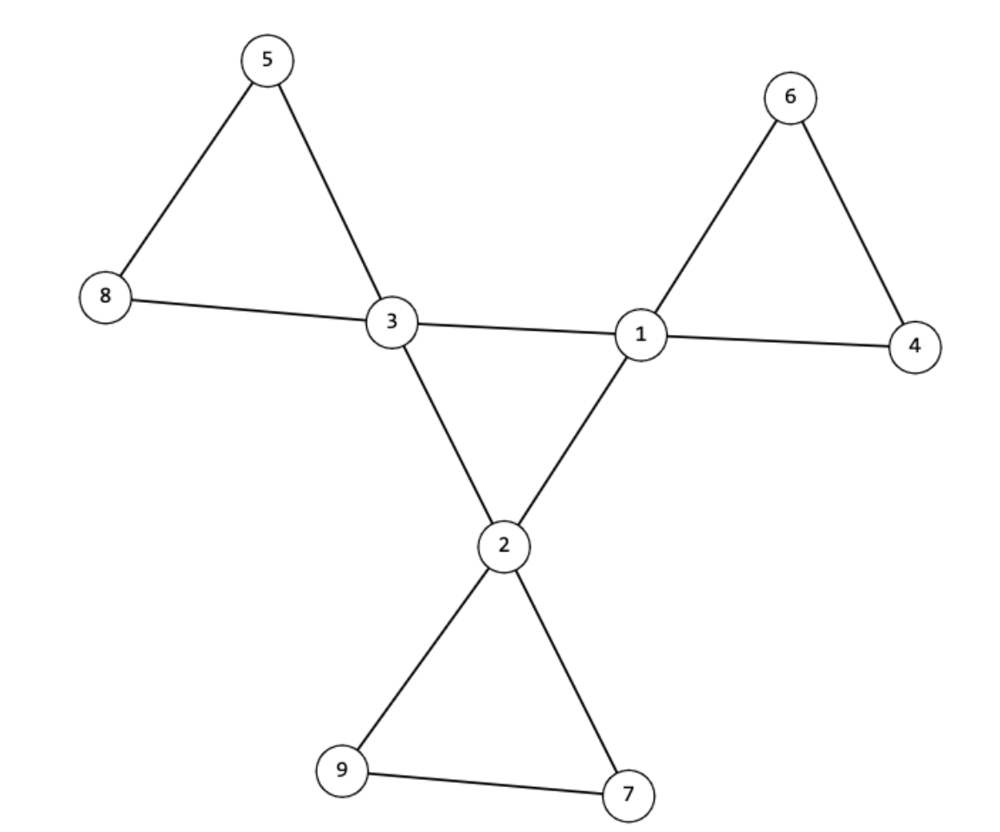

Codeforces Round 863 A-F

<!-- more -->

## 原题链接：[戳这里](https://codeforces.com/contest/1811)

## A. Insert Digit

### 题目大意

输入一个数字n和一个数字d(d<=9)， 将数字d插入到数字n的任意位置中， 求n的最大值。

### 思路

当k大于n中的某一个数时， 插入到这个数的前一个位置一定能保证最大

### 代码

```c++
int n, k;
char s[N];
 
void solve(){
	cin>>n>>k>>s;
	for(int i=0; i<n; i++){
		if(k>s[i]-'0'){
			for(int j=0; j<i; j++) cout<<s[j];
			cout<<k;
			for(int j=i; j<n; j++) cout<<s[j];
			cout<<'\n';
			return;
		}
	}cout<<s<<k<<'\n';
	
	
}
```


## B. Conveyor Belts

### 思路

将一个点所在的层数理解为到最外层的最短距离， 则本题可以转化为求两个点所在层数的差值

### 代码

```c++
int n, x1, y1, x2, y2;
 
void solve(){
	cin>>n>>x1>>y1>>x2>>y2;
	int t1 = min(min(x1, y1), min(n+1-x1, n+1-y1));
	int t2 = min(min(x2, y2), min(n+1-x2, n+1-y2));
	cout<<abs(t1-t2)<<'\n';
}
```

## C. Restore the Array

### 题目大意

构造一个序列a， 使得其经过转化后等于给定的序列b。

转化规则为b[i] = max(a[i], a[i+1])

### 思路

首先a[1]应该等于b[1]，接下来每次选择a[i+1]值的时候， 先考虑是否a[i]已经等于b[i]， 如果相等的话则只要a[i+1]<=a[i]并且a[i+1]<=b[i+1]就可以满足要求, 并且如果想要接下来的取值范围更大， 那么我们要让a[i+1]的值尽可能等于b[i+1]。 当a[i]不等于b[i]时， 则a[i]就取值为b[i]即可。

### 代码

```c++
int n;
int a[N], b[N];
 
void solve(){
	cin>>n;
	for(int i=1; i<n; i++) cin>>b[i];
	a[1] = b[1];
	for(int i=2; i<=n; i++){
		if(a[i-1]==b[i-1]) {
			if(i!=n&&b[i]<=a[i-1])
				a[i] = b[i];
			else
				a[i] = 0;
		}
		else a[i] = b[i-1];
	}
	for(int i=1; i<=n; i++) cout<<a[i]<<' ';
	cout<<'\n';
}
```


## D. Umka and a Long Flight

### 题目大意

给定一个n阶斐波那契矩形， 问是否可以将其用以下规则剪切为n+1个正方形。

+ 喷涂的那一块正方形边长为1
+ 最多有一对正方形边长相同
+ 每一块正方形的边长都是斐波那契数

### 思路

根据斐波那契数的性质， 我们发现每次减出一块正方形时都优先剪出最大的正方形， 即边长为当前矩形的宽。然后每一次都这样减下去， 如果出现无论怎么剪都无法让涂色的块不出现在正方形中的话， 则无法满足题意。

### 代码

```c++
int f[N] = {1, 1};
 
void init(){
	for(int i = 2; i<=45; i++) f[i] = f[i-1] + f[i-2];
}
 
int n, x, y;
 
void solve(){
	cin>>n>>x>>y;
	int h = f[n], w = f[n+1];
	while(!(h==1&&w==1)){
		if(h<w){
			if(y>h) w-=h, y-=h;
			else if(y<=w-h) w-=h;
			else{
				cout<<"NO\n";
				return;
			}
		}
		else{
			if(x>w) x-=w, h-=w;
			else if(x<=h-w) h-=w;
			else{
				cout<<"NO\n";
				return;
			}
		}
	}
	cout<<"YES\n";
}
```


## E. Living Sequence

### 题目大意

给定一个数在a序列的位置， 求该数是多少。 其中序列a为正整数序列与包含4的数的序列的差集

### 思路

通过打表找规律即可。

### 代码

```c++
int a[N] = {1};
int b[N] = {1};
int idx;
 
void init(){
	for(int i=1; b[i-1]<=1e12; i++) a[i] = a[i-1]*10, b[i] = b[i-1]*9, idx = i;
}
 
int n;
 
void solve(){
	cin>>n;
	int res = 0;
	for(int i = idx; i>=0; i--){
		if(b[i]>n) continue;
		int times = n/b[i];
        res+=(n/b[i])*a[i];
		n-=n/b[i]*b[i];	
        if(times>=4) res+=a[i];
	}
	cout<<res<<'\n';
}
```


## F. Is It Flower?

### 题目大意

判定一个图形是否满足以下性质。

+ 有n个顶点和m条边

+ 由k+1个正k边形组成, 其中中心图形的每一个顶点都有一个k边形。如图所示。



### 思路

判断这是否满足以下条件：

+ 有k\*k个顶点，k\*(k+1)条边， k>=3
+ 满足度数为4的点有k个， 剩余点的度数均为2
+ 度数为4的k个点构成一个环
+ 度数为4的每一点都挂着一个长度为k环

### 代码

```c++

int n, m, k;
vector<int> g[N];
int deg[N];
bool st[N];
 
void input(){
	cin>>n>>m;
	for(int i=1; i<=n; i++) {
		g[i].clear();
		deg[i] = 0;
		st[i] = 0;
	}
	for(int i=0; i<m; i++){
		int x, y;
		cin>>x>>y;
		g[x].push_back(y);
		g[y].push_back(x);
		deg[x]++, deg[y]++;
	}
}
 
bool check_deg(){
	int deg_2_num = 0, deg_4_num = 0;
	for(int i=1; i<=n; i++){
		if(deg[i] == 2) deg_2_num++;
		if(deg[i] == 4) deg_4_num++;
	}
	return deg_4_num == k && deg_2_num + deg_4_num == n;
}
 
int starting_ver;
 
bool check_deg_4_is_circle_dfs(int u, int fa, int num){
	vector<int> deg_4_vers;
	
	bool has_starting_ver = 0;
	
	for(auto ver:g[u]){
		if(ver == starting_ver) has_starting_ver = 1;
		if(deg[ver] == 4 && !st[ver]){
			deg_4_vers.push_back(ver);
		}
	}
	
	st[u] = 1;
	num++;
	
	int vers_size = deg_4_vers.size();
	
	if(vers_size == 0){
		return num == k && has_starting_ver;
	}
	else if(vers_size == 2){
		if(fa == 0) deg_4_vers.pop_back();
		else return false;
	}
	else if(vers_size > 2 ){
		return false;
	}
	
	return check_deg_4_is_circle_dfs(deg_4_vers[0], u, num);
}
 
bool check_deg_2_is_circle_dfs(int u, int fa, int num){
	vector<int> deg_2_vers;
	
	bool has_starting_ver = 0;
	
	for(auto ver:g[u]){
		if(ver == starting_ver) has_starting_ver = 1;
		if(deg[ver] == 2 && !st[ver]){
			deg_2_vers.push_back(ver);
		}
	}
	
	st[u] = 1;
	num++;
	
	int vers_size = deg_2_vers.size();
	
	if(vers_size == 0){
		return num == k && has_starting_ver;
	}
	else if(vers_size == 2){
		if(fa == 0) deg_2_vers.pop_back();
		else return false;
	}
	else if(vers_size > 2 ){
		return false;
	}
	
	return check_deg_2_is_circle_dfs(deg_2_vers[0], u, num);
}
 
bool check_deg_4_is_circle(){
	for(int i=1; i<=n; i++){
		if(deg[i] == 4){
			starting_ver = i;
			return check_deg_4_is_circle_dfs(i, 0, 0);
		}
	}
	return false;
}
 
bool check_all_deg_2_is_circle(){
	for(int i=1; i<=n; i++){
		if(deg[i] == 4){
			starting_ver = i;
			if(!check_deg_2_is_circle_dfs(i, 0, 0))
				return false;
		}
	}
	return true;
}
 
bool check(){
	if(!check_deg()) return false;
	if(!check_deg_4_is_circle()) return false;
	if(!check_all_deg_2_is_circle()) return false;
	return true;
}
 
void solve()
{
	input();
	
	k = round(sqrt(n));
	if(k<3 || k*k!=n || k*(k+1)!=m){
		cout<<"NO\n"; return;
	}
	
	if(check()){
		cout<<"YES\n";
	}
	else{
		cout<<"NO\n";
	}
}
```

