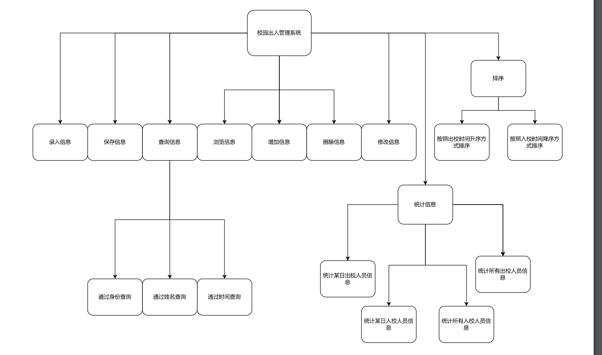

大一上学期C程序设计课课设,现在感觉整体架构不是很好,但也懒得再重构了www

<!-- more -->

## 实现功能

### 文字描述

1. 录入出入校园人员信息
2. 保存出入校园人员信息
3. 浏览出入校园人员信息
4. 查询出入校园人员信息
5. 增加出入校园人员信息
6. 删除出入校园人员信息
7. 修改出入校园人员信息
8. 统计出入校园人员信息
9. 对出、入校园人员信息分别进行排序
10. 退出

### 示意图


### 功能展示

#### 主页面


#### 录入界面


#### 保存界面


#### 浏览界面


#### 查询界面


#### 增加界面


#### 删除界面


#### 修改界面


#### 统计界面


#### 排序界面


#### 退出界面


## 代码

### 文件结构目录

+ CampusSystem
    - files
        + **database.txt**
    - include
        + **CampusSystem.h**
        + **Person.h**
        + **Time.h**
    - source
        + **CampusSystem.c**
        + **Person.c**
        + **Time.c**
    - **main.c**
    - **CampusSystem.dev**

### 源代码

#### main.c
```c
/*******************************************
 *
 *	@File name:校园出入管理系统 
 * 	@Author:Yhs_Joker
 *	@Version:1.1
 *	@Data:2022-11-5
 *
 ******************************************/

#include"./include/CampusSystem.h"

int main()
{
	System* p_system = (System*)malloc(sizeof(System));
	
	InitialSystem(p_system);
	OperationPage(p_system);
	DestructSystem(p_system);
	
	free(p_system);
	
}
```

#### CampusSystem.h
```c
#ifndef CAMPUS_SYSTEM_H
#define CAMPUS_SYSTEM_H

#include<stdio.h>
#include<stdlib.h>
#include<ctype.h>
#include<conio.h>

#include"Person.h"

#define EXPENSION_CAPACITY 100
#define INITIAL_CAPACITY 100
#define NPOS (SIZE_T)(-1)

typedef struct
{
	Person* person_array;
	SIZE_T size;
	SIZE_T capacity;
}System;

void InitialInfo(System* p_system);	//从文件中读取历史信息,初始化信息
void InitialSystem(System* p_system);	//构造系统
void DestructSystem(System* p_system);	//析构系统

void ExpandSystemCapacity(System* p_system);	//扩容系统

void PushBack(System* p_system, Person* p_person);	//尾插数据
void Erase(System* p_system, SIZE_T pos);			//删除数据

void PrintInfoList(System* p_system, SIZE_T index_array[]);	//打印列表中的数据

int InputPersonInfoToFind(Person* p_person);	//读入查找人员信息所需的数据
SIZE_T Find(System* p_system, SIZE_T index_array[]);	//查找人员

int IsSIZE_TFormat(const char str[]);	//判断是否是下标类型
void StrToSIZE_T(const char str[], SIZE_T* number);	//将字符串类型转化为下标类型
int InputSIZE_T(SIZE_T* number);	//读入下标类型

int InputSIZE_TFromRange(SIZE_T* number, SIZE_T left, SIZE_T right);	//读入下标类型,限制其范围为left-right

void ShowMenu();	//展示菜单

void ShowInputFormat();	//展示输入数据格式要求

void EnterInfo(System* p_system);//批量录入出入校园人员信息

void SaveInfo(System* p_system);	//保存出入校园人员信息

void ReadInfo(System* p_system);	//浏览出入校园人员信息

void SearchByIdentity(System* p_system);	//通过身份查询出入校园人员信息
void SearchByName(System* p_system);	//通过姓名查询出入校园人员信息
void SearchByTime(System* p_system);	//通过时间查询出入校园人员信息
void SearchInfo(System* p_system);	//查询出入校园人员信息

void CreateInfo(System* p_system);	//增加出入校园人员信息

void DeleteInfo(System* p_system);	//删除出入校园人员信息

void UpdateInfo(System* p_system);	//修改出入校园人员信息

void CountInfoFunc1(System* p_system, Time* p_time);	//通过某日时间统计出校园人员信息
void CountInfoFunc2(System* p_system, Time* p_time);	//通过某日时间统计入校园人员信息
void CountInfoFunc3(System* p_system);	//统计所有出校园人员信息
void CountInfoFunc4(System* p_system);	//统计所有入校园人员信息
void CountInfo(System* p_system);	//统计出入校园人员信息 

void SortInfoFunc1(System* p_system);	//出校升序方式排序
void SortInfoFunc2(System* p_system);	//入校降序方式排序
void SortInfo(System* p_system);	//排序出入校园人员信息 
 
void ExitSystem(System* p_system);	//退出系统

void OperationPage(System* p_system);	//用户操作界面

#endif
```

#### Person.h
```c
#ifndef PERSON_H
#define PERSON_H

#include<stdio.h>
#include<string.h>

#include"Time.h"

#define IDENTITY_SIZE 20
#define NAME_SIZE 12
#define NUMBER_SIZE 20
#define PHONE_NUMBER_SIZE 20
#define ID_NUMBER_SIZE 20

typedef enum
{
	ENTRY = 1,
	EXIT = 0
}Status;

typedef struct
{
	char identity[IDENTITY_SIZE];
	char name[NAME_SIZE];
	char number[NUMBER_SIZE];
	char phone_number[PHONE_NUMBER_SIZE];
	char id_number[ID_NUMBER_SIZE];
	Status status;	//出入校状态
	Time time;		//出入校时间
}Person;

int IsIdentityFormat(const char str[]);	//判断是否是身份类型格式
int InputIdentity(char identity[]);	//输入身份信息
int InputIdentityByFile(FILE* fp, char identity[]);	//通过文件输入身份信息

int IsNameFormat(const char str[]);		//判断是否是姓名类型格式
int InputName(char name[]);	//输入姓名信息
int InputNameByFile(FILE* fp, char name[]);	//通过文件输入姓名信息

int IsNumberFormat(const char str[]);	//判断是否是编号类型格式
int InputNumber(char number[]);	//输入编号信息
int InputNumberByFile(FILE* fp, char number[]);	//通过文件输入编号信息

int IsPhoneNumberFormat(const char str[]);	//判断是否是电话号类型格式
int InputPhoneNumber(char phone_number[]);	//输入电话号码信息
int InputPhoneNumberByFile(FILE* fp, char phone_number[]);

int IsIdNumberFormat(const char str[]);		//判断是否是身份证号类型格式
int InputIdNumber(char id_number[]);	//输入身份证信息
int InputIdNumberByFile(FILE* fp, char id_number[]);	//通过文件输入身份证号码信息

int IsStatusFormat(const char str[]);	//判断是否是出入校状态类型格式
void StrToStatus(const char str[],Status* p_status);	//字符串类型转化为状态类型
int InputStatus(Status* p_status);	//输入出入校状态信息
int InputStatusByFile(FILE* fp, Status* p_status);	//通过文件输入出入校状态信息

int InputPerson(Person* p_person);	//输入人员信息
int InputPersonByFile(FILE* fp, Person* p_person);	//通过文件输入人员信息

void ShowPersonInfo(SIZE_T order, Person* p_person);	//展示人员信息

int CmpByTimeFromSmallToBig(Person* lhs, Person* rhs);	//时间从小到大排序比较函数
int CmpByTimeFromBigToSmall(Person* lhs, Person* rhs);	//时间从大到小排序比较函数


#endif
```

#### Time.h
```c
#ifndef TIME_H
#define TIME_H

#include<string.h>
#include<ctype.h>
#include<stdio.h>

#define TIME_T unsigned int

#define BUFFER_SIZE 1024

typedef unsigned int SIZE_T;

typedef struct
{
	TIME_T year;
	TIME_T month;
	TIME_T day;
}Time;

int IsLeapYear(TIME_T year);	//判断是否是闰年

int IsTimeFormat(const char str[]);	//判断是否是时间类型格式
int StrToTime(const char str[],Time* p_time);	//转换为时间类型
int InputTime(Time* p_time);	//读入时间
int InputTimeByFile(FILE* fp, Time* p_time);	//通过文件读入时间
void ShowTime(Time* p_time);	//展示时间

void OutputTimeToFile(Time* p_time);	//向文件输出时间

int CmpTimeFunc(const Time* lhs, const Time* rhs);	//时间从小到大排序使用的比较函数
int CmpTimeFuncFromBigToSmall(const Time* lhs, const Time* rhs);	//时间从大到小排序使用的比较函数

#endif
```


#### CampusSystem.c
```c
#include"../include/CampusSystem.h"

const char path[]="./files/database.txt";	//保存文件路径

void InitialInfo(System* p_system)
{
	FILE* fp = fopen(path, "r");
	if(fp == NULL)
	{
		puts("读入文件不存在！");
		return;
	}
	Person person;
	while(InputPersonByFile(fp,&person) == 0)
	{
		PushBack(p_system, &person);
	}
}

void InitialSystem(System* p_system)
{
	SIZE_T malloc_size = INITIAL_CAPACITY * sizeof(Person);
	p_system->person_array = (Person*)malloc(malloc_size);
	
	if(p_system->person_array == NULL)
	{
		puts("在初始化阶段内存分配失败！");
		ExitSystem(p_system);
	}
	
	p_system->size = 0;
	p_system->capacity = 0;
	
	InitialInfo(p_system);
}

void DestructSystem(System* p_system)
{
	p_system->size = 0;
	p_system->capacity = 0;
	free(p_system->person_array);
}

void ExpandSystemCapacity(System* p_system)
{
	SIZE_T new_capacity = p_system->capacity + EXPENSION_CAPACITY;
	SIZE_T realloc_size = new_capacity * sizeof(Person);
	p_system->person_array = realloc(p_system->person_array, realloc_size);
	
	if(p_system->person_array == NULL)
	{
		puts("在扩容阶段内存分配失败！");
		ExitSystem(p_system);
	}
	
	p_system->capacity = new_capacity;
}

void PushBack(System* p_system,Person* p_person)
{
	SIZE_T previous_size = p_system->size;
	SIZE_T previous_capacity = p_system->capacity;
	
	if(previous_size == previous_capacity)
	{
		ExpandSystemCapacity(p_system);
	}
	
	p_system->person_array[previous_size] = *p_person;
	
	p_system->size = previous_size + 1;
}

void Erase(System* p_system, SIZE_T pos)
{
	SIZE_T previous_size = p_system->size;
	
	if(pos >= previous_size)
	{
		puts("删除操作不合法！");
		return;
	}
	
	Person* p_delete_pos = p_system->person_array + pos;
	SIZE_T moving_length = previous_size - pos - 1;
	SIZE_T moving_size = moving_length * sizeof(Person);
	
	memmove(p_delete_pos, p_delete_pos + 1, moving_size);
	
	p_system->size = previous_size - 1;
}

void PrintInfoList(System* p_system, SIZE_T index_array[])
{
	printf("+----+----------+---------------+--------------------+--------------------+--------------------+----+----------+\n");
	printf("|%-4s|%s\t|%-15s|%-20s|%-20s|%-20s|%-4s|%-10s|\n", "序号", "身份信息", "姓名", "编号", "电话号码", "身份证号", "状态", "出入校时间");
	printf("+----+----------+---------------+--------------------+--------------------+--------------------+----+----------+\n");
	
	for(SIZE_T i = 0; index_array[i] != NPOS; i++)
	{
		ShowPersonInfo(i+1, p_system->person_array + index_array[i]);
		puts("");
		printf("+----+----------+---------------+--------------------+--------------------+--------------------+----+----------+\n");
	}
}

int InputPersonInfoToFind(Person* p_person)
{
	int is_successful = 0;
	
	if(InputName(p_person->name) == -1)
	{
		puts("姓名录入格式错误！");
		is_successful = -1;
	}
	
	if(InputIdNumber(p_person->id_number) == -1)
	{
		puts("身份证录入格式错误！");
		is_successful = -1;
	}
	if(InputStatus(&(p_person->status)) == -1)
	{
		puts("出入校状态录入格式错误！");
		is_successful = -1;
	}
	if(InputTime(&(p_person->time)) == -1)
	{
		puts("出入校时间录入格式错误！");
		is_successful = -1;
	}
	return is_successful;
}

SIZE_T Find(System* p_system, SIZE_T index_array[])
{
	puts("请输入姓名，身份证号，出入校状态，出入校时间来确认删除成员：");
	puts("例:张三 110101199003079251 0 2222/10/02");
	puts("请输入信息：");
	Person person;
	while(InputPersonInfoToFind(&person) == -1)
	{
		puts("信息格式输入错误,请重新输入：");
	}
	
	SIZE_T array_size = p_system->size;
	Person* person_array = p_system->person_array;
	
	SIZE_T idx_arr_size = 0;
	
	for(int i = 0; i < array_size; i++)
	{
		if(strcmp(person.name, person_array[i].name) == 0  &&
			strcmp(person.id_number, person_array[i].id_number) == 0  &&
			person.status == person_array[i].status &&
			CmpTimeFunc(&person.time, &person_array[i].time) == 0)
		{
			index_array[idx_arr_size++] = i;
		}
	}
	index_array[idx_arr_size] = NPOS;
	return index_array[0];
}

int IsSIZE_TFormat(const char str[])
{
	for(int i=0; str[i]; i++)
	{
		if(isdigit(str[i]) == 0)
		{
			return -1;
		}
	}
	
	return 0;
}

void StrToSIZE_T(const char str[], SIZE_T* number)
{
	*number = (SIZE_T)atoi(str);
}

int InputSIZE_T(SIZE_T* number)
{
	char buffer[BUFFER_SIZE];
	
	scanf("%s",buffer);
	if(IsSIZE_TFormat(buffer) == -1)
		return -1;
	
	StrToSIZE_T(buffer, number);
	return 0;
}

int InputSIZE_TFromRange(SIZE_T* number, SIZE_T left, SIZE_T right)
{
	if(InputSIZE_T(number) == -1)
		return -1;
	if(*number<left || *number>right)
		return -1;
	return 0;
}

void ShowMenu()
{
	puts("+---------欢迎使用校园出入管理系统---------+");
	puts("|          (请输入0-9中的一个数)           |");
	puts("|                                          |");
	puts("|          1.录入出入校园人员信息          |");
	puts("|          2.保存出入校园人员信息          |");
	puts("|          3.浏览出入校园人员信息          |");
	puts("|          4.查询出入校园人员信息          |");
	puts("|          5.增加出入校园人员信息          |");
	puts("|          6.删除出入校园人员信息          |");
	puts("|          7.修改出入校园人员信息          |");
	puts("|          8.统计出入校园人员信息          |");
	puts("|          9.排序出入校园人员信息          |");
	puts("|          0.退出                          |");
	puts("|                                          |");
	puts("|                         作者：Yhs_Joker  |");
	puts("+------------------------------------------+");
}

void ShowInputFormat()
{
	puts("请按照以下规则输入信息：");
	puts("依次输入身份信息，姓名，编号，联系方式，身份证号，出入校状态，出入校时间");
	puts("");
	puts("名词解释：");
	puts("身份信息：“学生”,“教职工”,“其他”");
	puts("编号：全数字；如果没有则填写“无”");
	puts("联系方式：应为一串数字");
	puts("身份证号：应符合中国居民身份证标准");
	puts("出入校状态：0代表出校，1代表入校");
	puts("出入校时间：格式为yyyy/mm/dd，日期应合法，不能出现如2022/02/30这样的日期");
	puts("");
	puts("例:学生 张三 221002802 17517561757 110101199003079251 0 2222/10/02");
	puts("");
	puts("请按照提示填写信息!");
}

void EnterInfo(System* p_system)
{
	puts("录入出入校园人员信息");
	puts("");
	
	ShowInputFormat();
	
	puts("请输入批量录入信息数量：");
	
	SIZE_T person_num = 0;
	while(InputSIZE_T(&person_num) == -1)
	{
		puts("数字格式输入错误，请重新输入：");
	}
	
	puts("请依次输入信息：");
	for(SIZE_T i=0; i < person_num; i++)
	{
		Person person;
		
		while(InputPerson(&person) == -1)
		{
			puts("请重新输入信息：");
		}
		
		PushBack(p_system, &person);
		printf("%s的信息录入成功！\n", person.name);
	}
	
	puts("");
	puts("录入信息成功!");
	
}

void SaveInfo(System* p_system)
{
	puts("保存出入校园人员信息");
	puts("");
	
	SIZE_T array_size = p_system->size;
	FILE* fp = fopen(path, "w");
	for(int i = 0; i < array_size; i++)
	{
		Person* p = p_system->person_array + i;
		fprintf(fp, "%s %s %s %s %s %d %04u/%02u/%02u\n",
			p->identity, p->name, p->number, p->phone_number, 
			p->id_number, p->status, p->time.year, p->time.month, 
			p->time.day);
	}
	fclose(fp);
	
	puts("出入校信息已保存成功！请在files/database.txt中查看！");
	
}


void ReadInfo(System* p_system)
{
	puts("浏览出入校园人员信息");
	puts("");
	
	SIZE_T array_size = p_system->size;
	if(array_size == 0)
	{
		puts("系统中暂无人员信息");
		puts("");
		return;
	}
	
	SIZE_T* index_array = malloc((p_system->capacity + 1) * sizeof(SIZE_T));
	SIZE_T idx_arr_size = 0;
	for(int i = 0; i < p_system->size; i++)
		index_array[idx_arr_size++] = i;
	index_array[idx_arr_size] = NPOS;
	
	PrintInfoList(p_system, index_array);
	
	free(index_array);
}

void SearchByIdentity(System* p_system)
{
	puts("请输入人员身份：");
	
	char identity[IDENTITY_SIZE];
	while(InputIdentity(identity) == -1)
	{
		puts("身份格式输入错误，请重新输入：");
	}
	
	Person* person_array =p_system->person_array; 
	SIZE_T array_size = p_system->size;
	
	SIZE_T* index_array = malloc((p_system->capacity + 1) * sizeof(SIZE_T));
	SIZE_T idx_arr_size = 0;
	
	for(SIZE_T i = 0; i <array_size; i++)
	{
		if(strcmp(identity, person_array[i].identity) == 0)
		{
			index_array[idx_arr_size++] = i;
		}
	}
	index_array[idx_arr_size] = NPOS;
	
	PrintInfoList(p_system, index_array);
	
	free(index_array);
}

void SearchByName(System* p_system)
{
	puts("请输入姓名：");
	
	char name[NAME_SIZE];
	while(InputName(name) == -1)
	{
		puts("姓名格式输入错误，请重新输入：");
	}
	
	Person* person_array =p_system->person_array; 
	SIZE_T array_size = p_system->size;
	
	SIZE_T* index_array = malloc((p_system->capacity + 1) * sizeof(SIZE_T));
	SIZE_T idx_arr_size = 0;
	
	for(SIZE_T i = 0; i <array_size; i++)
	{
		if(strcmp(name, person_array[i].name) == 0)
		{
			index_array[idx_arr_size++] = i;
		}
	}
	index_array[idx_arr_size] = NPOS;
	
	PrintInfoList(p_system, index_array);
	
	free(index_array);
}

void SearchByTime(System* p_system)
{
	puts("请输入要查询的时间：");
	
	Time time;
	while(InputTime(&time) == -1)
	{
		puts("时间格式输入错误，请重新输入：");
	}
	
	Person* person_array =p_system->person_array; 
	SIZE_T array_size = p_system->size;
	
	SIZE_T* index_array = malloc((p_system->capacity + 1) * sizeof(SIZE_T));
	SIZE_T idx_arr_size = 0;
	
	for(SIZE_T i = 0; i <array_size; i++)
	{
		Time per_time = person_array[i].time;
		if(CmpTimeFunc(&per_time, &time) == 0)
		{
			index_array[idx_arr_size++] = i;
		}
	}
	index_array[idx_arr_size] = NPOS;
	
	PrintInfoList(p_system, index_array);
	
	free(index_array);
}

void SearchInfo(System* p_system)
{
	while(1)
	{
		puts("查询出入校园人员信息");
		puts("");
		puts("1.按照人员身份查询");
		puts("2.按照姓名查询");
		puts("3.按照出/入校时间查询");
		puts("0.退出");
		puts("请输入0-3之间的数字:");
		
		SIZE_T op;
		while(InputSIZE_TFromRange(&op, 0, 3) == -1)
		{
			puts("输入格式错误，请重新输入：");
		}
		
		switch(op)
		{
		case 1:
			SearchByIdentity(p_system);
			break;
			
		case 2:
			SearchByName(p_system);
			break;
			
		case 3:
			SearchByTime(p_system);
			break;
			
		case 0:
			return ;
		}
		
		system("pause");
		system("cls");
	}
	
}

void CreateInfo(System* p_system)
{
	puts("增加出入校园人员信息");
	puts("");
	ShowInputFormat();
	puts("请输入增加人员信息：");
	
	Person person;
	while(InputPerson(&person)==-1)
	{
		puts("请重新输入信息：");
	}
	PushBack(p_system, &person);
	puts("人员信息添加成功！");
	
	SaveInfo(p_system);
}

void DeleteInfo(System* p_system)
{
	puts("删除出入校园人员信息");
	puts("");
	
	SIZE_T* index_array = malloc((p_system->capacity + 1) * sizeof(SIZE_T));
	
	SIZE_T pos=Find(p_system, index_array);
	if(pos == NPOS)
	{
		puts("未查询到此人！");
		return;
	}
	
	puts("查询成功！");
	PrintInfoList(p_system, index_array);
	puts("是否要删除数据y/n?:");
	
	char buffer[BUFFER_SIZE];
	while(scanf("%s", buffer))
	{
		if(strlen(buffer) == 1)
		{
			if(buffer[0]=='y' || buffer[0]=='n')
			{
				break;
			}
		}
		puts("格式输入错误，请重新输入：");
	}
	
	if(buffer[0] == 'n')
	{
		return;
	}
	
	SIZE_T idx_arr_size = 0;
	while(index_array[idx_arr_size]!=NPOS) idx_arr_size++;
	
	puts("删除序号几的数据：");
	SIZE_T order = 0;
	while(InputSIZE_TFromRange(&order, 1, idx_arr_size) == -1)
	{
		puts("数据格式错误，请重新输入：");
	}
	pos = index_array[order - 1];
	
	Erase(p_system, pos);
	
	puts("删除成功！");
	SaveInfo(p_system);
	
	free(index_array);
}

void UpdateInfo(System* p_system)
{
	puts("修改出入校园人员信息");
	puts("");
	
	SIZE_T* index_array = malloc((p_system->capacity + 1) * sizeof(SIZE_T));
	
	SIZE_T pos=Find(p_system, index_array);
	if(pos == NPOS)
	{
		puts("未查询到此人！");
		return;
	}
	
	puts("查询成功！");
	PrintInfoList(p_system, index_array);
	
	puts("是否要修改数据y/n?:");
	
	char buffer[BUFFER_SIZE];
	while(scanf("%s", buffer))
	{
		if(strlen(buffer) == 1)
		{
			if(buffer[0]=='y' || buffer[0]=='n')
			{
				break;
			}
		}
		puts("格式输入错误，请重新输入：");
	}
	
	if(buffer[0] == 'n')
	{
		return;
	}
	
	SIZE_T idx_arr_size = 0;
	while(index_array[idx_arr_size]!=NPOS) idx_arr_size++;
	
	puts("修改序号几的数据？");
	SIZE_T order = 0;
	while(InputSIZE_TFromRange(&order, 1, idx_arr_size) == -1)
	{
		puts("数据格式错误，请重新输入：");
	}
	pos = index_array[order - 1];
	puts("修改哪项信息（0-6）：");
	
	SIZE_T index;
	while(InputSIZE_TFromRange(&index, 0, 6) == -1)
	{
		puts("输入数据错误，请重新输入：");
	}
	
	Person* person = p_system->person_array + pos;
	
	switch (index)
	{
		case 0:
			puts("请输入修改后的身份信息：");
			while(InputIdentity(person->identity) == -1)
			{
				puts("身份格式输入错误，请重新输入：");
			}
			break;
		case 1:
			puts("请输入修改后的姓名信息：");
			while(InputName(person->name) == -1)
			{
				puts("姓名格式输入错误，请重新输入：");
			}
			break;
		case 2:
			puts("请输入修改后的编号信息：");
			while(InputNumber(person->number) == -1)
			{
				puts("编号格式输入错误，请重新输入：");
			}
			break;
		case 3:
			puts("请输入修改后的电话号码：");
			while(InputPhoneNumber(person->phone_number) == -1)
			{
				puts("电话号码格式输入错误，请重新输入：");
			}
			break;
		case 4:
			puts("请输入修改后的身份证号码：");
			while(InputIdNumber(person->id_number) == -1)
			{
				puts("身份证号码格式输入错误，请重新输入：");
			}
			break;
		case 5:
			puts("请输入修改后的出入校信息：");
			while(InputStatus(&person->status) == -1)
			{
				puts("出入校状态格式输入错误，请重新输入：");
			}
			break;
		case 6:
			puts("请输入修改后的时间：");
			while(InputTime(&person->time) == -1)
			{
				puts("出入校时间格式输入错误，请重新输入：");
			}
			break;
	}
	puts("修改完成！");
	SaveInfo(p_system);
	
	free(index_array);
}

void CountInfoFunc1(System* p_system, Time* p_time)
{
	SIZE_T array_size = p_system->size;
	Person* person_array = p_system->person_array;
	SIZE_T student_num = 0;
	SIZE_T staff_num = 0;
	SIZE_T others_num = 0;
	SIZE_T* index_array = malloc((p_system->capacity + 1) * sizeof(SIZE_T));
	SIZE_T idx_arr_size = 0;
	for(SIZE_T i = 0; i < array_size; i++)
	{
		if(CmpTimeFunc(&person_array[i].time,p_time) != 0)
			continue;
		if(person_array[i].status == EXIT)
		{
			index_array[idx_arr_size++] = i;
			if(strcmp("学生",person_array[i].identity) == 0)
			{
				student_num++;
			}
			if(strcmp("教职工",person_array[i].identity) == 0)
			{
				staff_num++;
			}
			if(strcmp("其他",person_array[i].identity) == 0)
			{
				others_num++;
			}
		}
	}
	index_array[idx_arr_size] = NPOS;
	printf("当天出校人员总数：%u人，学生%u人，教职工%u人，其他%u人\n",student_num+staff_num+others_num,student_num,staff_num,others_num);
	PrintInfoList(p_system, index_array);
	free(index_array);
}

void CountInfoFunc2(System* p_system, Time* p_time)
{
	SIZE_T array_size = p_system->size;
	Person* person_array = p_system->person_array;
	SIZE_T student_num = 0;
	SIZE_T staff_num = 0;
	SIZE_T others_num = 0;
	SIZE_T* index_array = malloc((p_system->capacity + 1) * sizeof(SIZE_T));
	SIZE_T idx_arr_size = 0;
	for(SIZE_T i = 0; i < array_size; i++)
	{
		if(CmpTimeFunc(&person_array[i].time,p_time) != 0)
			continue;
		if(person_array[i].status == ENTRY)
		{
			index_array[idx_arr_size++] = i;
			if(strcmp("学生",person_array[i].identity) == 0)
			{
				student_num++;
			}
			if(strcmp("教职工",person_array[i].identity) == 0)
			{
				staff_num++;
			}
			if(strcmp("其他",person_array[i].identity) == 0)
			{
				others_num++;
			}
		}
	}
	index_array[idx_arr_size] = NPOS;
	printf("当天入校人员总数：%u人，学生%u人，教职工%u人，其他%u人\n",student_num+staff_num+others_num,student_num,staff_num,others_num);
	PrintInfoList(p_system, index_array);
	free(index_array);
}

void CountInfoFunc3(System* p_system)
{
	SIZE_T array_size = p_system->size;
	Person* person_array = p_system->person_array;
	SIZE_T student_num = 0;
	SIZE_T staff_num = 0;
	SIZE_T others_num = 0;
	SIZE_T* index_array = malloc((p_system->capacity + 1) * sizeof(SIZE_T));
	SIZE_T idx_arr_size = 0;
	for(SIZE_T i = 0; i < array_size; i++)
	{
		if(person_array[i].status == EXIT)
		{
			index_array[idx_arr_size++] = i;
			if(strcmp("学生",person_array[i].identity) == 0)
			{
				student_num++;
			}
			if(strcmp("教职工",person_array[i].identity) == 0)
			{
				staff_num++;
			}
			if(strcmp("其他",person_array[i].identity) == 0)
			{
				others_num++;
			}
		}
	}
	index_array[idx_arr_size] = NPOS;
	printf("所有时间段出校人员总数：%u人，学生%u人，教职工%u人，其他%u人\n",student_num+staff_num+others_num,student_num,staff_num,others_num);
	PrintInfoList(p_system, index_array);
	free(index_array);
}

void CountInfoFunc4(System* p_system)
{
	SIZE_T array_size = p_system->size;
	Person* person_array = p_system->person_array;
	SIZE_T student_num = 0;
	SIZE_T staff_num = 0;
	SIZE_T others_num = 0;
	SIZE_T* index_array = malloc((p_system->capacity + 1) * sizeof(SIZE_T));
	SIZE_T idx_arr_size = 0;
	for(SIZE_T i = 0; i < array_size; i++)
	{
		if(person_array[i].status == ENTRY)
		{
			index_array[idx_arr_size++] = i;
			if(strcmp("学生",person_array[i].identity) == 0)
			{
				student_num++;
			}
			if(strcmp("教职工",person_array[i].identity) == 0)
			{
				staff_num++;
			}
			if(strcmp("其他",person_array[i].identity) == 0)
			{
				others_num++;
			}
		}
	}
	index_array[idx_arr_size] = NPOS;
	printf("所有时间段入校人员总数：%u人，学生%u人，教职工%u人，其他%u人\n",student_num+staff_num+others_num,student_num,staff_num,others_num);
	PrintInfoList(p_system, index_array);
	free(index_array);
}

void CountInfo(System* p_system)
{
	while(1)
	{
		puts("统计出入校园人员信息");
		puts("");
		puts("1.统计某一天出校人员总数");
		puts("2.统计某一天入校人员总数");
		puts("3.统计所有时间段出校人员总数");
		puts("4.统计所有时间段入校人员总数");
		puts("0.退出");
		
		puts("请输入操作（0-4）：");
		
		SIZE_T op;
		while(InputSIZE_TFromRange(&op, 0, 4) == -1)
		{
			puts("数据格式错误，请重新输入：");
		}
		
		Time time;
		switch(op)
		{
			case 1:
				puts("请输入你想统计的日期：");
				while(InputTime(&time) == -1)
				{
					puts("输入格式错误，请重新输入：");
				}
				CountInfoFunc1(p_system,&time);
				break;
			case 2:
				puts("请输入你想统计的日期：");
				while(InputTime(&time) == -1)
				{
					puts("输入格式错误，请重新输入：");
				}
				CountInfoFunc2(p_system,&time);
				break;
			case 3:
				CountInfoFunc3(p_system);
				break;
			case 4:
				CountInfoFunc4(p_system);
				break;
			case 0:
				return;
		}
		
		system("pause");
		system("cls");
	}
}

void SortInfoFunc1(System* p_system)
{
	qsort(p_system->person_array, p_system->size, sizeof(Person), (int(*)(const void*,const void*))CmpByTimeFromSmallToBig);
	SIZE_T array_size = p_system->size;
	Person* person_array = p_system->person_array;
	SIZE_T* index_array = malloc((p_system->capacity + 1) * sizeof(SIZE_T));
	SIZE_T idx_arr_size = 0;
	for(SIZE_T i = 0; i < array_size; i++)
	{
		if(person_array[i].status == EXIT)
		{
			index_array[idx_arr_size++] = i;
		}
	}
	index_array[idx_arr_size] = NPOS;
	PrintInfoList(p_system, index_array);
	
	free(index_array);
}

void SortInfoFunc2(System* p_system)
{
	qsort(p_system->person_array, p_system->size, sizeof(Person), (int(*)(const void*,const void*))CmpByTimeFromBigToSmall);
	SIZE_T array_size = p_system->size;
	Person* person_array = p_system->person_array;
	SIZE_T* index_array = malloc((p_system->capacity + 1) * sizeof(SIZE_T));
	SIZE_T idx_arr_size = 0;
	for(SIZE_T i = 0; i < array_size; i++)
	{
		if(person_array[i].status == ENTRY)
		{
			index_array[idx_arr_size++] = i;
		}
	}
	index_array[idx_arr_size] = NPOS;
	PrintInfoList(p_system, index_array);
	
	free(index_array);
}

void SortInfo(System* p_system)
{
	while(1)
	{
		puts("排序出入校园人员信息");
		puts("");
		puts("1.对出校人员按出校时间进行升序排序");
		puts("2.对入校人员按入校时间进行降序排序");
		puts("0.退出");
		
		puts("请输入操作（0-2）：");
		
		SIZE_T op;
		while(InputSIZE_TFromRange(&op, 0, 2) == -1)
		{
			puts("输入数据错误，请重新输入：");
		}
		
		switch(op)
		{
			case 1:
				SortInfoFunc1(p_system);
				break;
			case 2:
				SortInfoFunc2(p_system);
				break;
			case 0:
				return;
		}
		
		system("pause");
		system("cls");
	}
}

void ExitSystem(System* p_system)
{
	puts("是否要退出系统(y/n):");
	
	char buffer[BUFFER_SIZE];
	while(scanf("%s", buffer))
	{
		if(strlen(buffer) == 1)
		{
			if(buffer[0]=='y' || buffer[0]=='n')
			{
				break;
			}
		}
		puts("格式输入错误，请重新输入：");
	}
	
	if(buffer[0] == 'n')
	{
		return;
	}
	
	system("cls");
	
	puts("退出系统");
	puts("");
	SaveInfo(p_system);
	
	puts("感谢使用！");
	
	system("pause");
	exit(0);
}

void OperationPage(System* p_system)
{
	while(1)
	{
		system("cls");
		ShowMenu();
		
		char op=_getch();
		
		system("cls");
		switch(op)
		{
		case '1':
			EnterInfo(p_system);
			break;
		case '2':
			SaveInfo(p_system);
			break;
		case '3':
			ReadInfo(p_system);
			break;
		case '4':
			SearchInfo(p_system);
			break;
		case '5':
			CreateInfo(p_system);
			break;
		case '6':
			DeleteInfo(p_system);
			break;
		case '7':
			UpdateInfo(p_system);
			break;
		case '8':
			CountInfo(p_system);
			break;
		case '9':
			SortInfo(p_system);
			break;
		case '0':
			ExitSystem(p_system);
			break;
		default:
			break;
		}
		system("pause");
		
	}
}
```


#### Person.c


```c
#include"../include/Person.h"

const char identity_list[][IDENTITY_SIZE]={"学生","教职工","其他"};	//身份类型列表

int IsIdentityFormat(const char str[])
{
	if(strlen(str) >= IDENTITY_SIZE)
	{
		return -1;
	}
	
	SIZE_T identity_list_size = sizeof(identity_list) / sizeof(identity_list[0]);
	for(SIZE_T i = 0; i < identity_list_size; i++)
	{
		if(strcmp(str, identity_list[i]) == 0)
		{
			return 0;
		}
	}
	return -1;
}

int InputIdentity(char identity[])
{
	char buffer[BUFFER_SIZE];
	scanf("%s", buffer);
	
	if(IsIdentityFormat(buffer) == -1)
	{
		return -1;
	}
	
	strcpy(identity, buffer);
	return 0;
}

int InputIdentityByFile(FILE* fp, char identity[])
{
	char buffer[BUFFER_SIZE];
	fscanf(fp, "%s", buffer);
	
	if(IsIdentityFormat(buffer) == -1)
	{
		return -1;
	}
	
	strcpy(identity, buffer);
	return 0;
}

int IsNameFormat(const char str[])
{
		if(strlen(str) >= NAME_SIZE)
		{
			return -1;
		}
		
	return 0;
}

int InputName(char name[])
{
	char buffer[BUFFER_SIZE];
	scanf("%s", buffer);
	
	if(IsNameFormat(buffer) == -1)
	{
		return -1;
	}
	
	strcpy(name, buffer);
	return 0;
}

int InputNameByFile(FILE* fp, char name[])
{
	char buffer[BUFFER_SIZE];
	fscanf(fp, "%s", buffer);
	
	if(IsNameFormat(buffer) == -1)
	{
		return -1;
	}
	
	strcpy(name, buffer);
	return 0;
}

int IsNumberFormat(const char str[])
{
	if(strlen(str) >= NUMBER_SIZE)
	{
		return -1;
	}
		
	if(strcmp(str, "无") == 0)
	{
		return 0;
	}
	
	for(int i = 0; str[i]; i++)
	{
		if(isdigit(str[i]) == 0)
		{
			return -1;
		}
	}
	
	return 0;
}

int InputNumber(char number[])
{
	char buffer[BUFFER_SIZE];
	scanf("%s", buffer);
	
	if(IsNumberFormat(buffer) == -1)
	{
		return -1;
	}
	
	strcpy(number, buffer);
	return 0;
}

int InputNumberByFile(FILE* fp, char number[])
{
	char buffer[BUFFER_SIZE];
	fscanf(fp, "%s", buffer);
	
	if(IsNumberFormat(buffer) == -1)
	{
		return -1;
	}
	
	strcpy(number, buffer);
	return 0;
}

int IsPhoneNumberFormat(const char str[])
{
	if(strlen(str) >= PHONE_NUMBER_SIZE)
	{
		return -1;
	}
	for(int i = 0; str[i]; i++)
	{
		if(isdigit(str[i]) == 0)
		{
			return -1;
		}
	}
	return 0;
}

int InputPhoneNumber(char phone_number[])
{
	char buffer[BUFFER_SIZE];
	scanf("%s", buffer);
	
	if(IsPhoneNumberFormat(buffer) == -1)
	{
		return -1;
	}
	
	strcpy(phone_number, buffer);
	return 0;
}

int InputPhoneNumberByFile(FILE* fp, char phone_number[])
{
	char buffer[BUFFER_SIZE];
	fscanf(fp, "%s", buffer);
	
	if(IsPhoneNumberFormat(buffer) == -1)
	{
		return -1;
	}
	
	strcpy(phone_number, buffer);
	return 0;
}

int IsIdNumberFormat(const char str[])
{
	int length = strlen(str);
	
	if(length >= ID_NUMBER_SIZE || length<=10)
	{
		return -1;
	}
	
	for(int i = 0; i<length - 1; i++)
	{
		if(isdigit(str[i]) == 0 )
		{
			return -1;
		}
	}
	
	char last_ch = str[length - 1];
	if(isdigit(last_ch)==0 && tolower(last_ch)!='x')
	{
		return -1;
	}
	
	return 0;
}

int InputIdNumber(char id_number[])
{
	char buffer[BUFFER_SIZE];
	scanf("%s", buffer);
	
	if(IsIdNumberFormat(buffer) == -1)
	{
		return -1;
	}
	
	strcpy(id_number, buffer);
	return 0;
}

int InputIdNumberByFile(FILE* fp, char id_number[])
{
	char buffer[BUFFER_SIZE];
	fscanf(fp, "%s", buffer);
	
	if(IsIdNumberFormat(buffer) == -1)
	{
		return -1;
	}
	
	strcpy(id_number, buffer);
	return 0;
}

int IsStatusFormat(const char str[])
{
	if(strcmp(str, "0") == 0)
		return 0;
	if(strcmp(str, "1") == 0)
		return 0;
	return -1;
}

void StrToStatus(const char str[],Status* p_status)
{
	if(str[0] == '0') *p_status = EXIT;
	if(str[0] == '1') *p_status = ENTRY;
}

int InputStatus(Status* p_status)
{
	char buffer[BUFFER_SIZE];
	scanf("%s", buffer);
	
	if(IsStatusFormat(buffer) == -1)
	{
		return -1;
	}
	
	StrToStatus(buffer, p_status);
	return 0;
}

int InputStatusByFile(FILE* fp, Status* p_status)
{
	char buffer[BUFFER_SIZE];
	fscanf(fp, "%s", buffer);
	
	if(IsStatusFormat(buffer) == -1)
	{
		return -1;
	}
	
	StrToStatus(buffer, p_status);
	return 0;
}

int InputPerson(Person* p_person)
{
	int is_successful = 0;
	
	
	if(InputIdentity(p_person->identity) == -1)
	{
		puts("身份信息录入格式错误！");
		is_successful = -1;
	}
	if(InputName(p_person->name) == -1)
	{
		puts("姓名录入格式错误！");
		is_successful = -1;
	}
	if(InputNumber(p_person->number) == -1)
	{
		puts("编号录入格式错误！");
		is_successful = -1;
	}
	if(InputPhoneNumber(p_person->phone_number) == -1)
	{
		puts("电话号码录入格式错误！");
		is_successful = -1;
	}
	if(InputIdNumber(p_person->id_number) == -1)
	{
		puts("身份证录入格式错误！");
		is_successful = -1;
	}
	if(InputStatus(&(p_person->status)) == -1)
	{
		puts("出入校状态录入格式错误！");
		is_successful = -1;
	}
	if(InputTime(&(p_person->time)) == -1)
	{
		puts("出入校时间录入格式错误！");
		is_successful = -1;
	}
	return is_successful;
}

int InputPersonByFile(FILE* fp, Person* p_person)
{
	if(InputIdentityByFile(fp, p_person->identity) == -1)
	{
		return -1;
	}
	if(InputNameByFile(fp, p_person->name) == -1)
	{
		return -1;
	}
	if(InputNumberByFile(fp, p_person->number) == -1)
	{
		return -1;
	}
	if(InputPhoneNumberByFile(fp, p_person->phone_number) == -1)
	{
		return -1;
	}
	if(InputIdNumberByFile(fp, p_person->id_number) == -1)
	{
		return -1;
	}
	if(InputStatusByFile(fp, &p_person->status) == -1)
	{
		return -1;
	}
	if(InputTimeByFile(fp, &p_person->time) == -1)
	{
		return -1;
	}
	return 0;
}

void ShowPersonInfo(SIZE_T order, Person* p_person)
{
	printf("|%- 4d|%s\t|%-15s|%-20s|%-20s|%-20s|%- 4d|",
		order, p_person->identity, p_person->name, 
		p_person->number, p_person->phone_number, 
		p_person->id_number, p_person->status);
	ShowTime(&p_person->time);
	printf("|");
}

int CmpByTimeFromSmallToBig(Person* lhs, Person* rhs)
{
	return CmpTimeFunc(&lhs->time, &rhs->time);
}
int CmpByTimeFromBigToSmall(Person* lhs, Person* rhs)
{
	return CmpTimeFuncFromBigToSmall(&lhs->time, &rhs->time);
}
```


#### Time.c
```c
#include"../include/Time.h"

const char time_format[11]="yyyy/mm/dd"; //时间格式信息

const TIME_T common_year[13]={0,31,28,31,30,31,30,31,31,30,31,30,31};	//平年信息

const TIME_T leap_year[13]={0,31,29,31,30,31,30,31,31,30,31,30,31};	//闰年信息

int IsLeapYear(TIME_T year)
{
	return (year%400 == 0) || (year%100 != 0  &&  year%4 == 0);
}

int IsTimeFormat(const char str[])
{
	SIZE_T time_length = strlen(time_format);
	if(strlen(str) != time_length)
		return -1;
	
	for(SIZE_T i = 0; i < time_length; i++)
	{
		if(time_format[i]=='y' || time_format[i]=='m' || time_format[i]=='d')
		{
			if(isdigit(str[i]) == 0)
			{
				return -1;
			}
		}
		else
		{
			if(str[i] != time_format[i])
			{
				return -1;
			}
		}
	}
	return 0;
}

int StrToTime(const char str[],Time* p_time)
{
	TIME_T year = 0;
	TIME_T month = 0;
	TIME_T day = 0;
	SIZE_T time_length = strlen(str);
	for(SIZE_T i = 0; i < time_length; i++)
	{
		if(time_format[i] == 'y')
		{
			year = year * 10 + str[i] - '0';
		}
		if(time_format[i] == 'm')
		{
			month = month * 10 + str[i] - '0';
		}
		if(time_format[i] == 'd')
		{
			day = day * 10 + str[i] - '0';
		}
	}
	
	if(month<1 || month>12)
	{
		return -1;
	}
	
	if(IsLeapYear(year))
	{
		if(day<1 || day>leap_year[month])
		{
			return -1;
		}
	}
	else
	{
		if(day<1 || day>common_year[month])
		{
			return -1;
		}
	}
	
	
	*p_time = (Time){year, month, day};
	
	return 0;
}

int InputTime(Time* p_time)
{
	char buffer[BUFFER_SIZE];
	scanf("%s",buffer);
	
	if(IsTimeFormat(buffer) == -1)
	{
		return -1;
	}
	
	if(StrToTime(buffer, p_time) == -1)
	{
		return -1;
	}
	
	return 0;
}

int InputTimeByFile(FILE* fp, Time* p_time)
{
	char buffer[BUFFER_SIZE];
	fscanf(fp, "%s",buffer);
	
	if(IsTimeFormat(buffer) == -1)
	{
		return -1;
	}
	
	if(StrToTime(buffer, p_time) == -1)
	{
		return -1;
	}
	
	return 0;
}

void ShowTime(Time* p_time)
{
	printf("%04u/%02u/%02u", p_time->year,p_time->month, p_time->day);
}

int CmpTimeFunc(const Time* lhs, const Time* rhs)
{
	if(lhs->year != rhs->year) return lhs->year - rhs->year;
	if(lhs->month != rhs->month) return lhs->month - rhs->month;
	return lhs->day - rhs->day;
}

int CmpTimeFuncFromBigToSmall(const Time* lhs, const Time* rhs)
{
	return CmpTimeFunc(rhs,lhs);
}
```